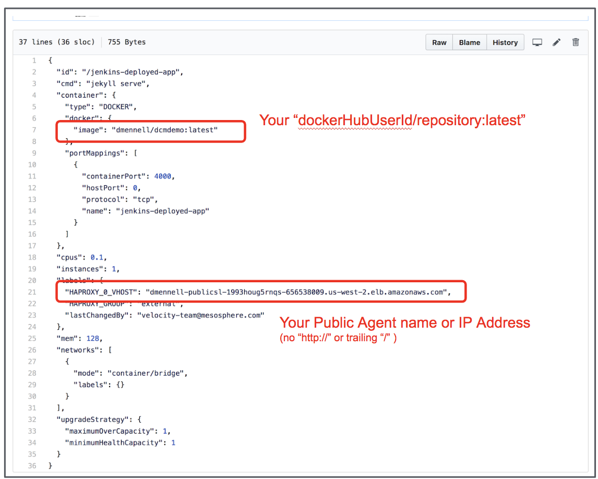
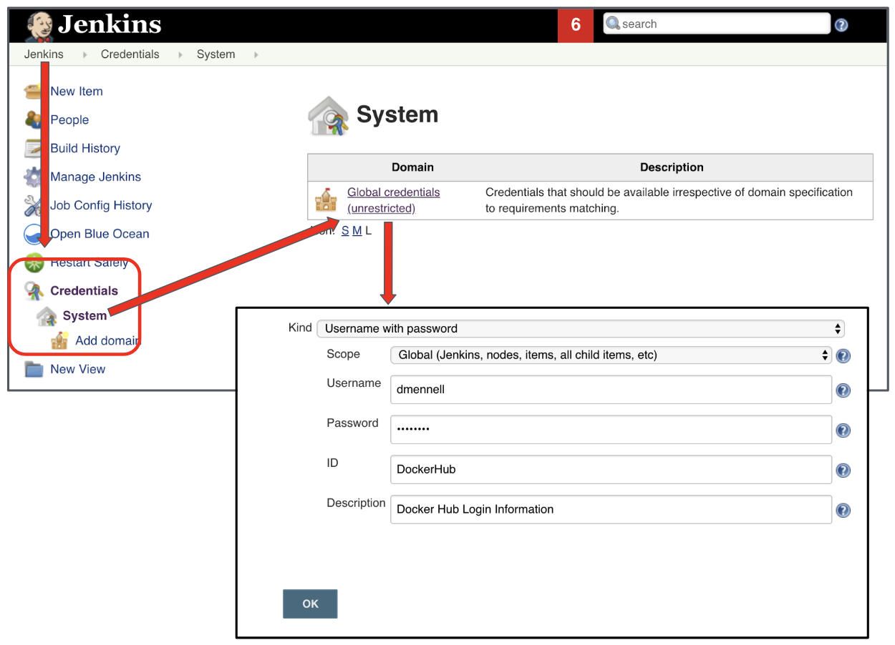
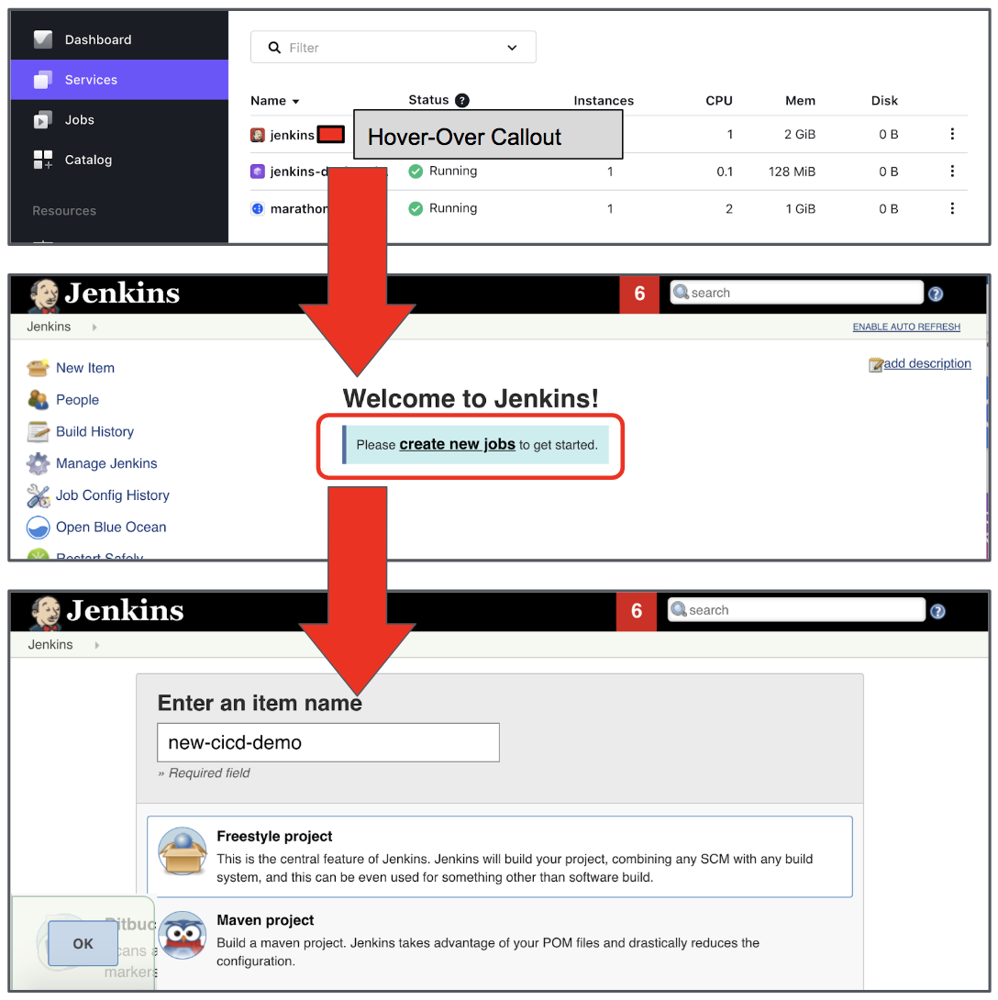
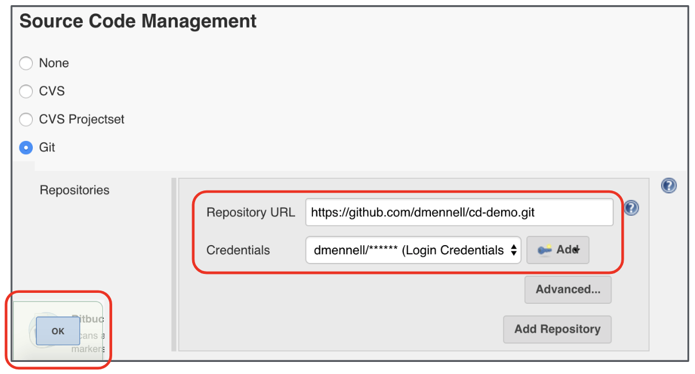

# jenkinsDemo

## Step-By-Step Walkthrough

### Account Access
* GitHub Account (w/credentials)
* DockerHub Account (w/credentials)
* Running DC/OS Cluster (w/publicNode)

### Prerequisites
* Fork the “mesosphere/cd-demo” GitHub Repo using your account
* Deploy Jenkins in DC/OS (default settings)
* Deploy Marathon LB (default settings)
* Modify the “conf/cd-demo-app.conf” File

### Configure Jenkins
1. Input Account Credentials for GitHub and DockerHub
Build New “Freeform Project”
BUILD!

### Modify Application Deployment File
Modify the “conf/cd-demo-app.js” in the GitHub Repository that you forked for the demo.  The simplest way to do it is to navigate in the browser into the file, click the pencil (upper right) to edit, and the make the appropriate changes.  Don’t forget to “Commit Changes” (bottom) when you are done.  This can be done either before or during the demo based on desire, time, and confidence level.

### Add Credentials
This section describes how to input credentials for GitHub and Docker Hub.  this assumes that you have forked mesosphere/cd-demo.

Credentials
->System
  ->Global Credentials (Unrestricted)
    ->Add Credentials
          
You will need to add two sets of credentials:
* GitHub
* DockerHub

### Create New Freeform Project
Opening the Jenkins Web UI from the hover over “launch” next to the sdervice name
Click the “create new jobs” link under the “Welcome to Jenkins” banner
Select “Freestyle project” and enter a name for your project (lover case letters and “-” only please)
Click “OK”

### Configure Source Code Management 
In the configuration screen, navigate to the “Source Code Management” section, and configure the following entries:

* Repository URL: Enter the URL for your forked GitHub repo
* Credentials: Select your previously configured GitHub Credentials

Click `OK/APPLY`

  

